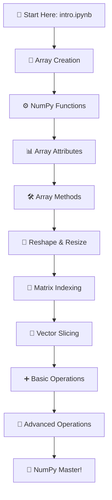

# 🔢 NumPy Mastery Hub

[](https://www.python.org/)
[](https://numpy.org/)
[](https://jupyter.org/)
[](https://opensource.org/licenses/MIT)
[](http://makeapullrequest.com)

> 🚀 **A comprehensive, hands-on journey through NumPy** - from absolute basics to advanced array operations. Perfect for data scientists, machine learning engineers, and Python developers.

---

## 📋 Table of Contents

- [🎯 Overview](#-overview)
- [🗂️ Repository Structure](#️-repository-structure)
- [⚡ Quick Start](#-quick-start)
- [📚 Learning Roadmap](#-learning-roadmap)
- [🛠️ Prerequisites](#️-prerequisites)
- [📈 Progress Tracker](#-progress-tracker)
- [🤝 Contributing](#-contributing)
- [📄 License](#-license)

---

## 🎯 Overview

This repository contains **11 carefully crafted Jupyter notebooks** covering every aspect of NumPy you need to master data manipulation and scientific computing in Python. Each notebook includes practical examples, exercises, and real-world applications.

### 🌟 What You'll Learn
- ✅ NumPy array creation and manipulation
- ✅ Advanced indexing and slicing techniques
- ✅ Mathematical operations and broadcasting
- ✅ Array reshaping and dimensional analysis
- ✅ Performance optimization techniques

---

## 🗂️ Repository Structure

### 📁 **1. NumPy Arrays** - *Foundation Level*
| Notebook | Description | Difficulty | Direct Link |
|----------|-------------|------------|-------------|
| 🌱 **A. intro.ipynb** | Introduction to NumPy ecosystem | Beginner | [📖 Open](./1.%20Numby%20Arrays/A.%20intro.ipynb) |
| 🔨 **B. array_creation.ipynb** | Array creation methods & techniques | Beginner | [📖 Open](./1.%20Numby%20Arrays/B.%20array_creation.ipynb) |
| ⚙️ **C. Numpy_func.ipynb** | Essential functions & utilities | Beginner | [📖 Open](./1.%20Numby%20Arrays/C.%20Numpy_func.ipynb) |
| 📊 **D. arr_attributes.ipynb** | Array properties & metadata | Intermediate | [📖 Open](./1.%20Numby%20Arrays/D.%20arr_attributes.ipynb) |
| 🛠️ **E. arr_methods.ipynb** | Built-in array methods | Intermediate | [📖 Open](./1.%20Numby%20Arrays/E.%20arr_methods.ipynb) |
| 🔄 **F. reshape_resize.ipynb** | Reshaping & resizing arrays | Intermediate | [📖 Open](./1.%20Numby%20Arrays/F.%20reshape_resize.ipynb) |

### 📁 **2. Arrays Indexing & Slicing** - *Intermediate Level*
| Notebook | Description | Difficulty | Direct Link |
|----------|-------------|------------|-------------|
| 🎯 **indexing_slicing_matrix.ipynb** | 2D array indexing mastery | Intermediate | [📖 Open](./2.%20Arrays%20Indexing%20%26%20Slicing/indexing_slicing_matrix.ipynb) |
| 📍 **indexing_slicing_vectors.ipynb** | 1D array slicing techniques | Intermediate | [📖 Open](./2.%20Arrays%20Indexing%20%26%20Slicing/indexing_slicing_vectors.ipynb) |

### 📁 **3. Array Operations** - *Advanced Level*
| Notebook | Description | Difficulty | Direct Link |
|----------|-------------|------------|-------------|
| ➕ **A.Operation_1.ipynb** | Basic arithmetic operations | Intermediate | [📖 Open](./3.%20Array_operations/A.Operation_1.ipynb) |
| 🧮 **A.Operation_2.ipynb** | Advanced mathematical operations | Advanced | [📖 Open](./3.%20Array_operations/A.Operation_2.ipynb) |

---

## ⚡ Quick Start

### 🛠️ Prerequisites

```bash
# Install required packages
pip install numpy jupyter 
```

### 🚀 Launch Instructions

```bash
# Clone the repository
git clone https://github.com/Surveh18/numpy-mastery-hub.git
cd numpy-mastery-hub

# Start Jupyter Notebook
jupyter notebook

# Open your first notebook
# Navigate to: 1. Numby Arrays → A. intro.ipynb
```

---

## 📚 Learning Roadmap



### 📈 Recommended Learning Path

| Phase | Duration | Focus Area | 
|-------|----------|------------|
| **Phase 1** | 2-3 days | NumPy Basics | 
| **Phase 2** | 3-4 days | Array Manipulation | 
| **Phase 3** | 2-3 days | Indexing & Slicing | 
| **Phase 4** | 3-4 days | Operations Mastery | 

---

## 📈 Progress Tracker

Track your learning journey:

- [ ] 🌱 **Beginner**: Completed intro.ipynb
- [ ] 🔨 **Creator**: Mastered array creation
- [ ] ⚙️ **Functional**: Understanding NumPy functions
- [ ] 📊 **Analytical**: Working with array attributes
- [ ] 🛠️ **Methodical**: Using array methods effectively
- [ ] 🔄 **Transformer**: Reshaping arrays with confidence
- [ ] 🎯 **Indexer**: Advanced indexing techniques
- [ ] 📍 **Slicer**: Professional slicing operations
- [ ] ➕ **Calculator**: Basic operations mastery
- [ ] 🧮 **Mathematician**: Advanced operations expert
- [ ] 🏆 **NumPy Master**: All notebooks completed!

---

## 🤝 Contributing

We welcome contributions! Here's how you can help:

### 🎯 Ways to Contribute
- 📝 Add more examples and use cases
- 🐛 Fix bugs or improve existing code
- 📚 Enhance documentation
- 🌟 Suggest new topics or notebooks
- 🔍 Review and test notebooks

### 📋 Contribution Guidelines
1. Fork the repository
2. Create a feature branch: `git checkout -b feature/amazing-feature`
3. Commit your changes: `git commit -m 'Add amazing feature'`
4. Push to the branch: `git push origin feature/amazing-feature`
5. Open a Pull Request

---

## 📄 License

This project is licensed under the MIT License - see the [LICENSE](LICENSE) file for details.

---

## 🙏 Acknowledgments

- **NumPy Development Team** for the amazing library
- **Jupyter Project** for the interactive notebook environment
- **Python Community** for continuous support and inspiration

---

<div align="center">

### 🌟 **Found this helpful? Give it a star!** ⭐

**Happy Learning! 🎉**

*Made with ❤️ for the Python community*

</div>

---

<div align="center">
  
  
</div>
